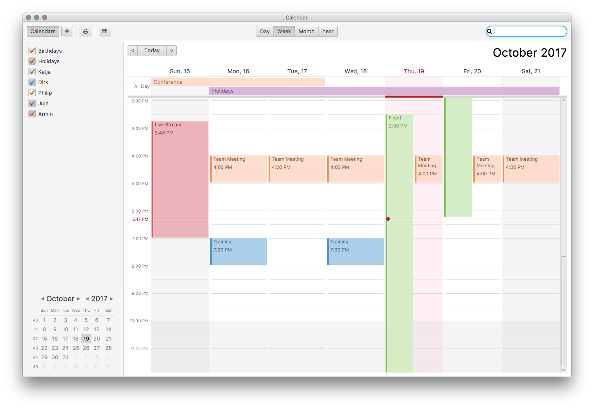
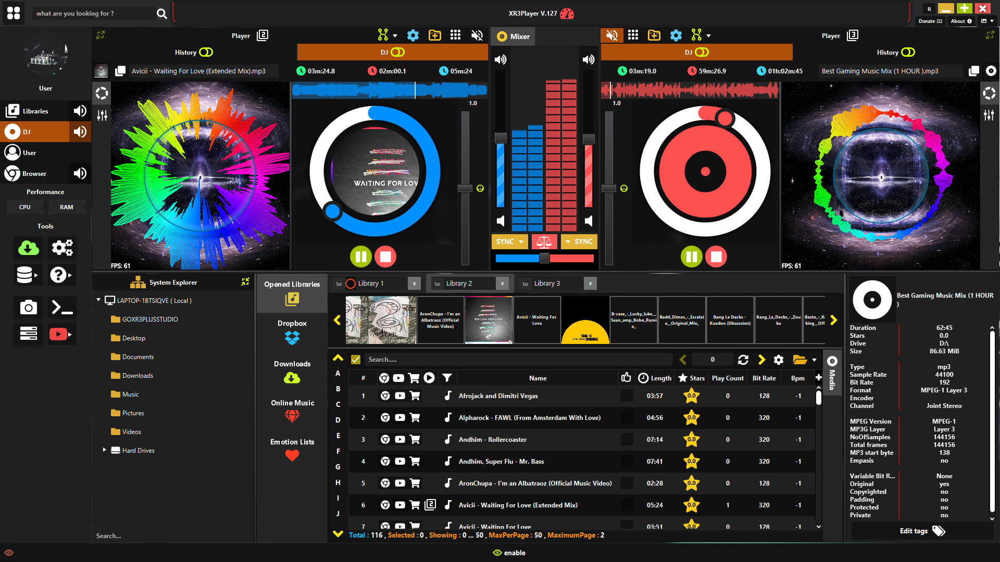
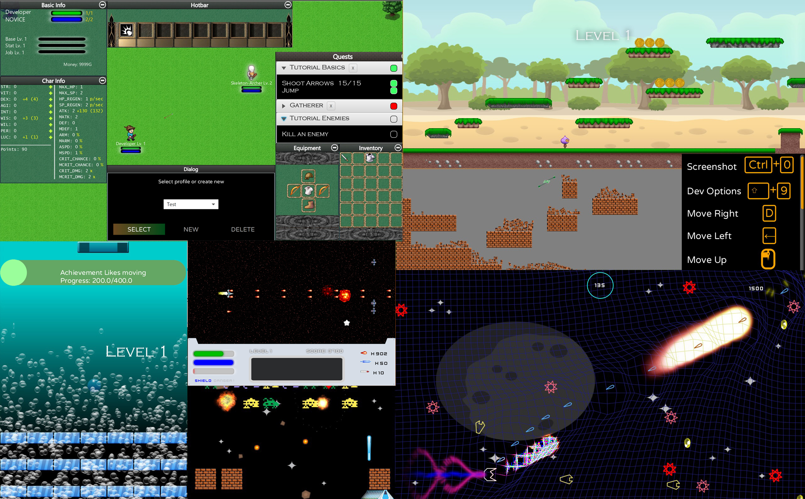
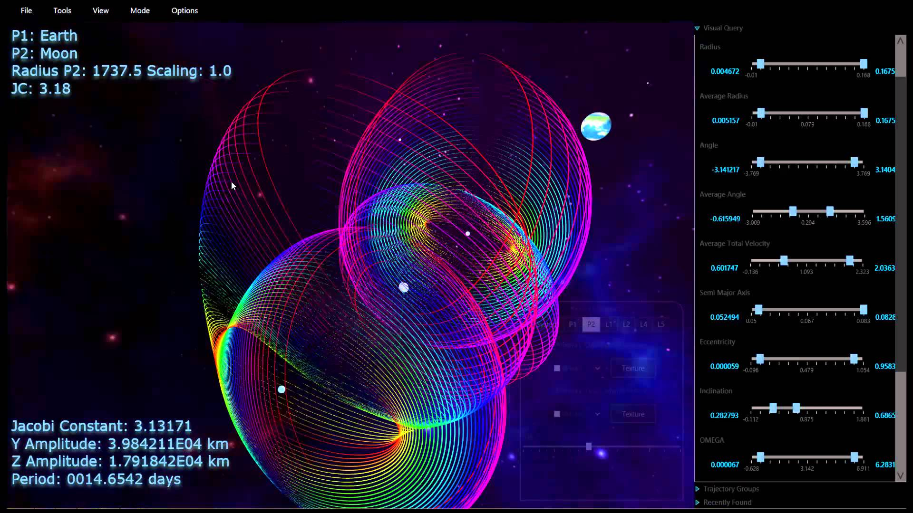

# O que é JavaFX

JavaFX é uma biblioteca java usada para construir aplicações GUI que podem ser executadas de forma consistente em diversas plataformas. Os aplicativos desenvolvidos usando JavaFX podem ser executados em diversos dispositivos, como computadores de mesa, telefones celulares, TVs, tablets, etc.

**Exemplos de aplicações**
| | |
|:----:|:----:|
| [**CalendarFX**](https://github.com/dlsc-software-consulting-gmbh/CalendarFX)  Uma Framework sofisticadas para criar calendários.| [**XR3PLayer**](https://github.com/goxr3plus/XR3Player)  Um poderoso Media player em javaFX + Web Browser | 
[**FXGL**](https://github.com/AlmasB/FXGL)  Engine para jogos em javaFX  | [**DSTE**](https://ai-solutions.com/deep-space-trajectory-explorer/)  Explorador de trajetória do espaço profundo|
|||