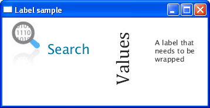

# Label


Este capitulo explica como usar a classe Label que reside no pacote javafx.scene.control que é um elemento de texto para exibir na tela. Aprender também a como agrupar um elemento de texto para caber no espaço, adicionar uma imagem e aplicar efeitos especiais.

##### aplicação de exemplo com Labels


## Criando um Label

A classe Label fornece 3 contrutores para criar labels em seu aplicativo, como monstrado abaixo.

```
//Para criar Label vazio 
Label label1 = new Label();

//Label com elemento de texto
Label label2 = new Label("Search");

//Um Label com elemento de texto e uma imagem
Image image = new Image(getClass().getResourceAsStream("labels.jpg"));
Label label3 = new Label("Search", new ImageView(image)); 
```
Uma vez que você tenha criado um label no seu codigo, você pode adicionar ou modificar o texto e o elemento grafico (no caso acima é uma imagem, mas poderia ser outro elemento como por exemplo um botão) usando as seguintes funções da classe Label.

- setText(String text) altera o texto do Label
- setGraphic(Node graphic) especifica o icone.

O metodo setTextFill especifica a cor do elemento de texto do Label. No exemplo abaixo criamos um Label, adicionamos uma imagem e especificamos um cor.

```
Label label1 = new Label("Search");
Image image = new Image(getClass().getResourceAsStream("labels.jpg"));
label1.setGraphic(new ImageView(image));
label1.setTextFill(Color.web("#0076a3")); 
```
##### adicionando um icone e cor para o Label 


Quando definimos ambos texto e conteudo grafico para o nosso Label, podemos usar a função setGraphicTextGap para adicionar espaço entre eles.

Além disso, você pode variar a posição do conteudo do Label dentro da sua area de layout, usando o metodo setTextAligment. Você pode também definir a posição do elemento grafico relativa ao texto através do metodo setContentDisplay e especificando como parametro uma das seguintes constantes: ContentDisplay.LEFT, ContentDisplay.RIGHT, ContentDisplay.CENTER, ContentDisplay.TOP, ContentDisplay.BOTTOM.

## Definindo fonte

```
//Use a constructor of the Font class
label1.setFont(new Font("Arial", 30));
//Use the font method of the Font class
label2.setFont(Font.font("Cambria", 32));
```

## Quebra de Texto

```
Label label3 = new Label("A label that needs to be wrapped");
label3.setWrapText(true);
```

## Aplicando Efeitos

```
Label label2 = new Label ("Values");
label2.setFont(new Font("Cambria", 32));
label2.setRotate(270);
label2.setTranslateY(50);
```